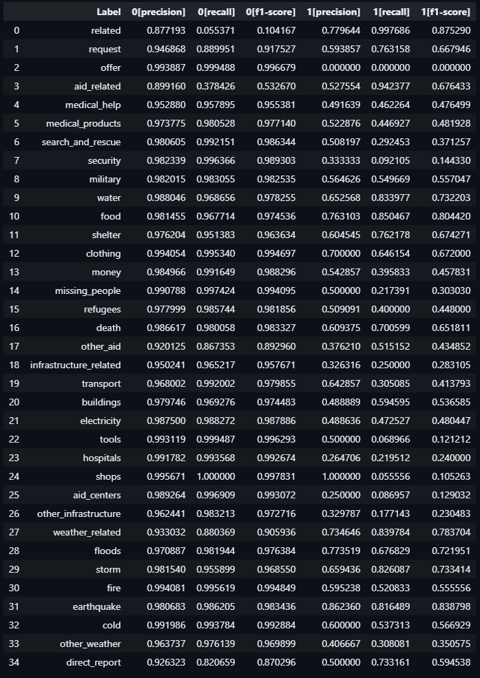
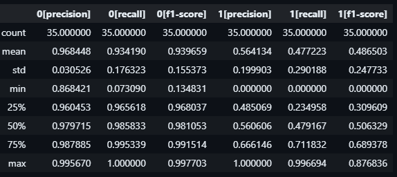

# Disaster Response Classifier

## Project Overview
This project is the second assignment in the Udacity Data Science Nanodegree program. The objective is to develop an application that can classify disaster-related messages into various categories, aiding in disaster response efforts. 

The provided datasets include messages and corresponding categories. The project involves building a data pipeline to process and clean the data, then saving it to a local SQLite database. This processed data will be used to create a machine learning pipeline, which trains a multi-output classification model to categorize the messages.

For the web application, I chose Flask for the backend. However, instead of the front-end technologies introduced in the course, I opted to build the frontend using **React** and **Tailwind CSS**, for a modern and responsive user interface.

---

## Table of Contents
1. [Installation](#installation)
2. [Usage](#usage)
3. [File Structure](#file-structure)
4. [Model](#model)


## Installation

To set up the application locally, follow these steps:

### 1. Clone the repository:
```
git clone https://github.com/Danco74/udacity_dr_project.git
cd udacity_dr_project
```
### 2. Run the setup script
```
python setup.py
```
-----------------------------------------------------------------------------

## Usage

### 1. Activate the virutal environment
```
.venv\Scripts\activate
```
### 2. Run the backend
```
python run_backend.py
```
### 2. Run the frontend
```
python run_frontend.py
```

-----------------------------------------------------------------------------

## File Structure
```
UDACITY_DR_PROJECT/
│
├── app/                    # Application folder
│   ├── backend/            # Backend files
│   └── frontend/           # Frontend files (React + npm dependencies)
│
├── data/                   # Dataset and data processing scripts
│   ├── DisasterResponse.db  # SQLite database
│   ├── messages.csv        # Raw message data
│   ├── categories.csv      # Raw categories data
│   └── process_data.py     # Data cleaning and preprocessing script
│
├── model/                  # Model training and storage
│   ├── classifier.pkl      # Trained classifier model
│   └── train_classifier.py # Model training script
│
├── notebooks/              # Jupyter notebooks
│   ├── ETL Pipeline Preparation.ipynb
│   └── ML Pipeline Preparation.ipynb
│
├── .venv/                  # Python virtual environment
├── setup.py                # Setup and installation script
├── run_backend.py          # Script to run the backend server
├── run_frontend.py         # Script to run the frontend server
├── README.md               # This file
└── requirements.txt        # Python dependencies
```

-----------------------------------------------------------------------------


## ML Model

During the machine learning pipeline phase, I made several attempts to improve the model's performance. These efforts included adding new features, experimenting with different models, and performing hyperparameter tuning using Grid Search. All of these attempts are thoroughly documented in the accompanying ML notebook, which outlines my approach and the progression of the modeling process.

Please note that I did not include the Grid Search in the final ML script due to its high computational cost and the significant time it requires to complete. However, the final results of the model can be seen below:





### Results Summary:


---------------------------
